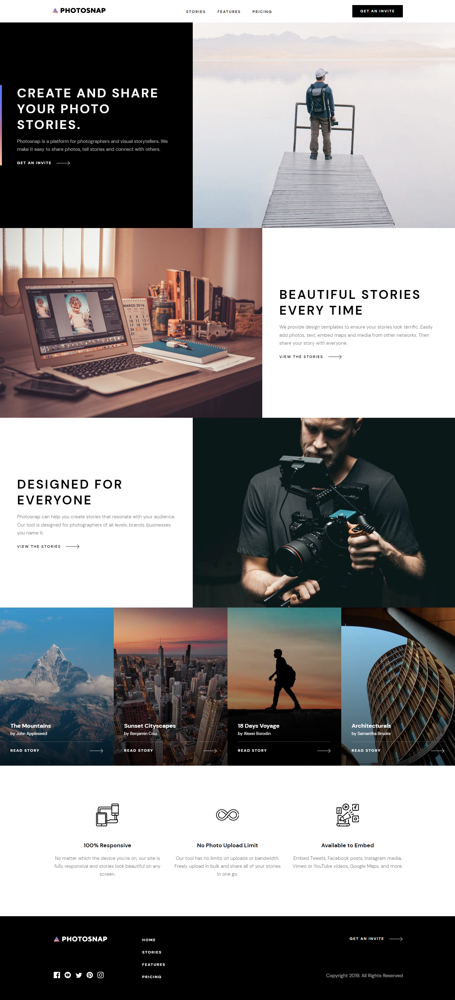
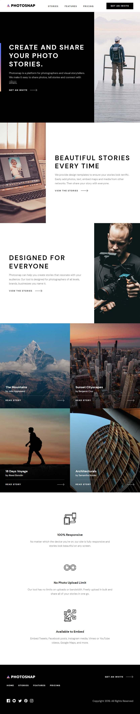
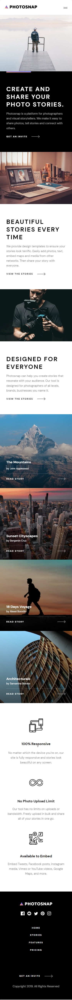

# Photosnap Website

This is a multi-page website. This website was made with a mobile first approach. It uses JavaScript for rendering users' stories and for toggle monthly/yearly pay plans.

## Table of contents

- [Overview](#overview)
  - [The challenge](#the-challenge)
  - [Screenshots](#screenshots)
  - [Links](#links)
  - [Built with](#built-with)
- [Author](#author)

## Overview

### The challenge

Users should be able to:

- View the optimal layout for each page depending on their device's screen size
- See hover states for all interactive elements throughout the site

### Screenshots

### Links

- Solution URL: https://github.com/Umlen/photosnap-multi-page-website
- Live Site URL: https://photosnapwebsite.netlify.app/

### Built with

- Semantic HTML5 markup
- SCSS preprocessor
- Flexbox
- CSS Grid
- Mobile-first workflow
- JavaScript

## Author

- Website - http://viktorpatrin.com/
- Frontend Mentor - https://www.frontendmentor.io/profile/Umlen
